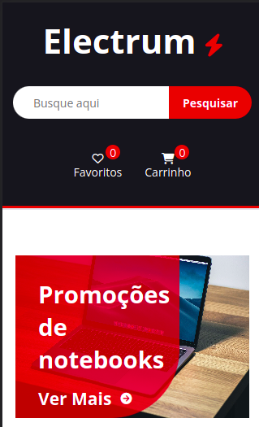

# Home page of an e-commerce

- Mixins
- Placeholder Selectors
- MediaQueries
- Variables
- Nesting
- Parent Selector (&)
- SMACSS Architecture

## Scripts

> watch changes in sass files

```sh
npm start
```

## Screenshots

[Clique aqui](https://lp-electrum-ecommerce-sass.vercel.app/) para acessar o deploy do projeto :)




